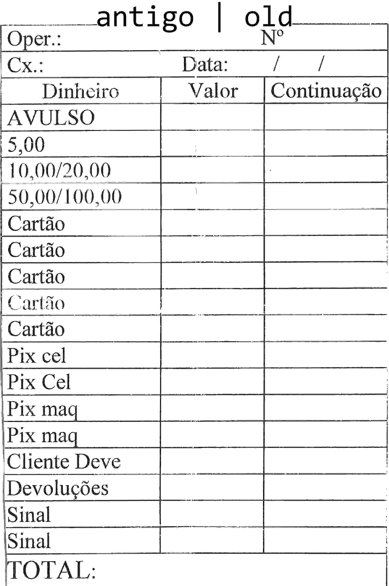
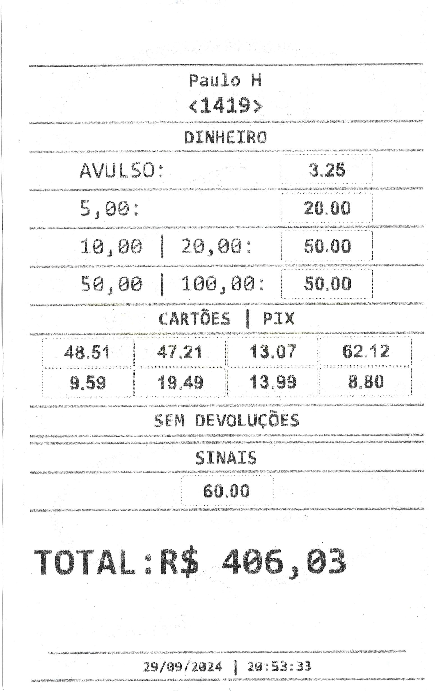

# Fechamento de caixa

Este projeto foi desenvolvido para automatizar o processo de fechamento de caixa, no qual são anotadas compras feitas fora do sistema. Anteriormente, o fechamento era realizado manualmente, utilizando papel e caneta. Com a implementação deste sistema, o processo foi otimizado, permitindo que os valores sejam somados automaticamente e impressos diretamente na impressora térmica, a mesma utilizada para a impressão de notas fiscais.

This project was developed to automate the cash register closing process, in which purchases made outside the system are recorded. Previously, the closing was done manually, using paper and pen. With the implementation of this system, the process was optimized, allowing values to be summed automatically and printed directly on the thermal printer, the same one used for printing receipts.

works better on Chromium

  
  

